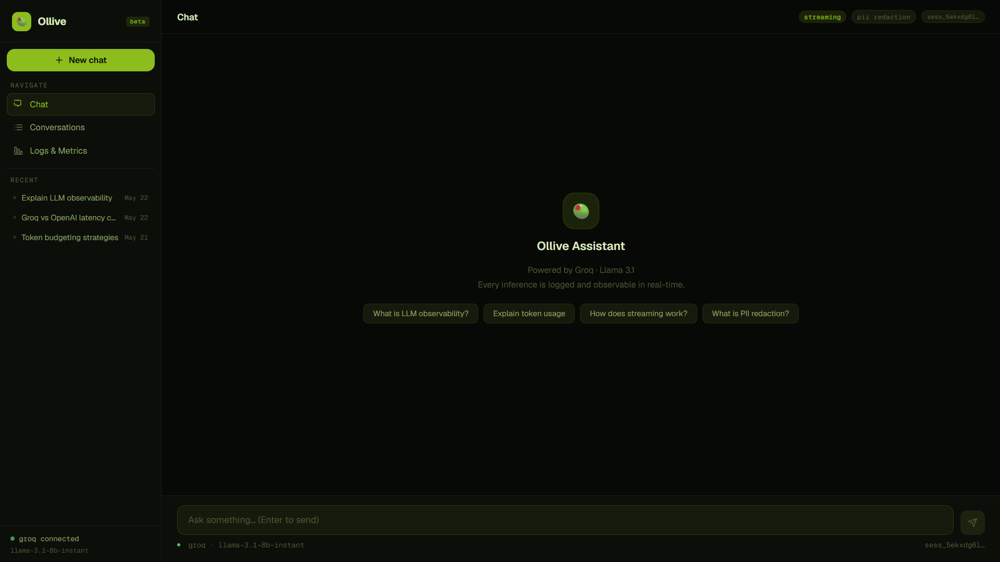
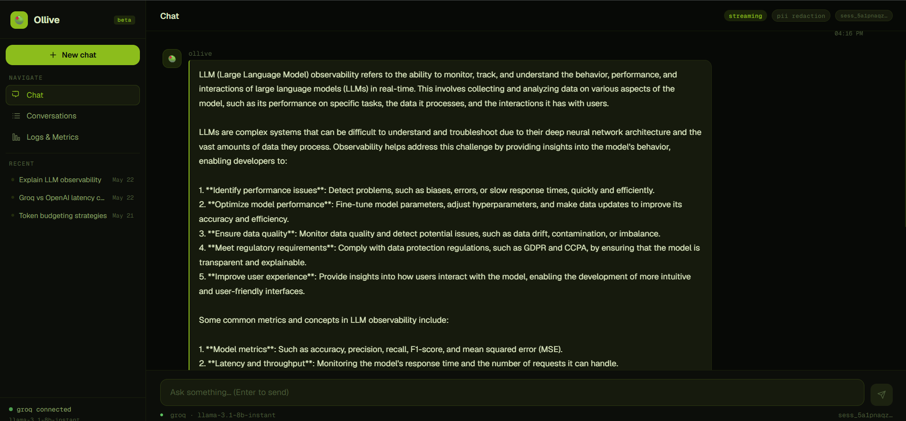
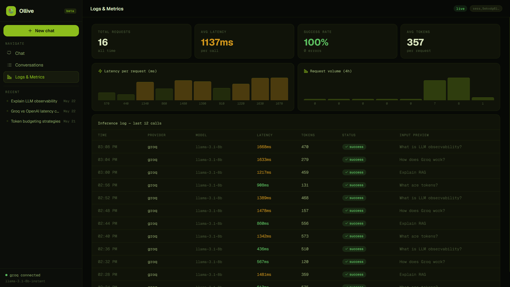
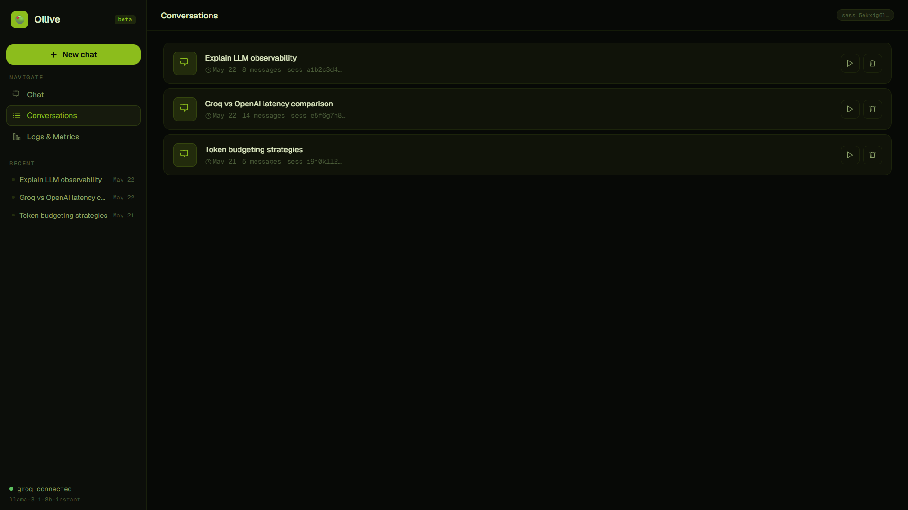

# 🫒 Ollive Inference Logger

> A lightweight LLM observability and inference logging system — built for real-time AI monitoring, conversation management, and analytics.

   

---
## Overview

Ollive Inference Logger is a full-stack AI observability platform that wraps LLM API calls with a lightweight logging middleware, streams responses to users in real time, and persists structured inference metadata to MongoDB. A live dashboard surfaces latency, token usage, error rates, and conversation history — giving operators full visibility into every inference event.

---

## Features

| Feature | Status |
|---|---|
| Multi-turn streaming chat | ✅ |
| Inference logging middleware (SDK wrapper) | ✅ |
| Real-time ingestion pipeline | ✅ |
| Latency / throughput / error dashboard | ✅ |
| PII redaction before persistence | ✅ |
| Conversation list and resume | ✅ |
| Cancel in-flight requests | ✅ |
| Session ID tracking | ✅ |
| Token usage capture | ✅ |
| Input/output previews in logs | ✅ |
| Structured MongoDB schema | ✅ |
| Architecture designed for multi-provider extensibility | ✅ |

---

## Tech Stack

**Frontend:** React 18, Vite, custom CSS design system  
**Backend:** Node.js (ESM), Express  
**LLM Provider:** Groq (Llama 3.1 70B)  
**Database:** MongoDB (Mongoose)  
**Streaming:** Server-Sent Events (SSE)  
**Dev tooling:** Nodemon, dotenv

---

## Folder Structure

```
ollive-inference-logger/
├── backend/
│   ├── server.js                  # Express app entry point
│   ├── routes/
│   │   ├── chat.js                # /api/chat streaming endpoint
│   │   ├── logs.js                # /api/logs ingestion + retrieval
│   │   └── conversations.js       # /api/conversations CRUD
│   ├── middleware/
│   │   └── llmWrapper.js          # LLM SDK wrapper — captures metadata
│   ├── models/
│   │   ├── InferenceLog.js        # Inference log schema
│   │   ├── Conversation.js        # Conversation schema
│   │   └── Message.js             # Message schema
│   └── utils/
│       └── piiRedactor.js         # PII redaction utility
├── frontend/
│   ├── src/
│   │   ├── App.jsx                # Root app with nav
│   │   └── components/
│   │       ├── Chat.jsx           # Streaming chat interface
│   │       ├── ConversationList.jsx
│   │       └── LogsDashboard.jsx  # Analytics dashboard
│   └── index.css
├── .env.example
├── .gitignore
├── README.md
└── ARCHITECTURE.md
```

---

## Setup Instructions

### Prerequisites

- Node.js v18+
- MongoDB Atlas account (or local MongoDB)
- Groq API key — [get one free at console.groq.com](https://console.groq.com)

### 1. Clone the repository

```bash
git clone https://github.com/tiru-venkatesh/ollive-ai.git
cd ollive-ai
```

### 2. Configure environment variables

```bash
cp .env.example .env
```

Edit `.env`:

```env
GROQ_API_KEY=gsk_your_key_here
MONGO_URI=mongodb+srv://your_cluster_uri
PORT=3001
```

### 3. Install and run the backend

```bash
cd backend
npm install
npm run dev
```

Backend runs at: `http://localhost:3001`

### 4. Install and run the frontend

```bash
cd frontend
npm install
npm run dev
```

Frontend runs at: `http://localhost:5173`

---

## Environment Variables

| Variable | Description | Required |
|---|---|---|
| `GROQ_API_KEY` | Groq API key for Llama 3.1 | ✅ |
| `MONGO_URI` | MongoDB connection string | ✅ |
| `PORT` | Backend server port (default: 3001) | Optional |

---

## API Endpoints

### Chat

| Method | Endpoint | Description |
|---|---|---|
| `POST` | `/api/chat` | Send message, stream response via SSE |

**Request body:**
```json
{
  "message": "Hello!",
  "sessionId": "uuid-string",
  "history": [{ "role": "user", "content": "..." }]
}
```

### Logs

| Method | Endpoint | Description |
|---|---|---|
| `POST` | `/api/logs` | Ingest inference log |
| `GET` | `/api/logs` | Retrieve all logs (paginated) |

### Conversations

| Method | Endpoint | Description |
|---|---|---|
| `GET` | `/api/conversations` | List all conversations |
| `GET` | `/api/conversations/:id` | Get conversation with messages |
| `DELETE` | `/api/conversations/:id` | Delete a conversation |

---

## Database Schema

### InferenceLog

```js
{
  sessionId:     String,        // links to conversation
  provider:      String,        // "groq"
  model:         String,        // "llama-3.1-70b-versatile"
  latencyMs:     Number,        // end-to-end response time
  promptTokens:  Number,
  completionTokens: Number,
  totalTokens:   Number,
  status:        String,        // "success" | "error"
  error:         String,
  inputPreview:  String,        // first 200 chars, PII redacted
  outputPreview: String,        // first 200 chars
  timestamp:     Date
}
```

### Conversation

```js
{
  sessionId:  String,           // uuid, client-generated
  createdAt:  Date,
  updatedAt:  Date,
  title:      String            // first user message (truncated)
}
```

### Message

```js
{
  sessionId:  String,
  role:       String,           // "user" | "assistant"
  content:    String,
  timestamp:  Date
}
```

**Design rationale:** Keeping inference logs separate from messages allows independent querying of observability data without joining through conversation records. `sessionId` is the shared key across all three collections — simple, denormalized, and fast for read-heavy dashboard queries.

---

## Logging Pipeline

```
User sends message
        ↓
Frontend POST /api/chat
        ↓
llmWrapper.js intercepts → records start timestamp
        ↓
Groq API call (streaming)
        ↓
SSE stream → frontend renders tokens live
        ↓
Stream complete → latency calculated
        ↓
PII redacted from input/output previews
        ↓
POST /api/logs → InferenceLog saved to MongoDB
        ↓
Message saved to Conversation
        ↓
Dashboard reflects new data on next fetch
```

---

## Tradeoffs Made

**SSE over WebSockets:** Simpler to implement with Express; unidirectional streaming is all we need for LLM responses. WebSockets would add unnecessary bidirectional complexity.

**MongoDB over PostgreSQL:** Schema flexibility during rapid iteration. Inference metadata structure may evolve; MongoDB makes this painless. A relational DB would be more appropriate at scale with stable schema.

**Client-generated session IDs (UUID):** Avoids a session-creation round-trip before the first message. Simpler and fast enough for this use case.

**In-process logging (sync with response):** Logs are written after stream completion rather than queued async. Acceptable for this scale — at production load, a queue (Redis/Kafka) would decouple logging from the hot path.

**Single LLM provider (Groq):** Architecture is built for multi-provider extensibility via the `provider` field in the wrapper and schema. Groq was chosen for stability, low latency, and free-tier availability during development.

---

## What I Would Improve With More Time

- **Event-based architecture** — replace direct POST logging with a Redis/Kafka queue so logging never blocks the response path
- **Docker Compose** — one-command local setup for backend + frontend + MongoDB
- **Auth layer** — JWT-based user sessions so conversations are scoped per user
- **Distributed tracing** — OpenTelemetry integration for per-span visibility
- **Kubernetes deployment** — Helm chart for self-hosted k8s with horizontal pod autoscaling
- **Multi-provider routing** — Gemini, OpenAI, Anthropic behind the same wrapper interface
- **Alerting** — webhook alerts when error rate or P95 latency exceeds threshold
- **Log export** — CSV/JSON download from the dashboard


---
## Screenshots

### Chat UI


### Chat SECTION


### Logs Dashboard


### Conversations


---
**Live App:** https://ollive-ai.vercel.app
---

## License

MIT
